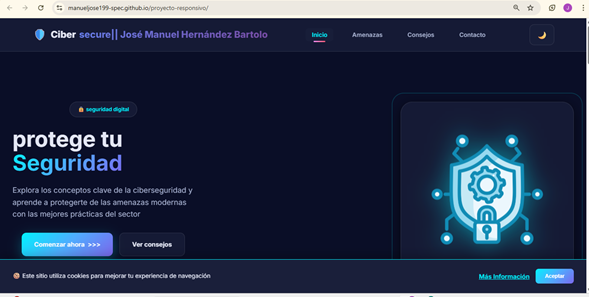
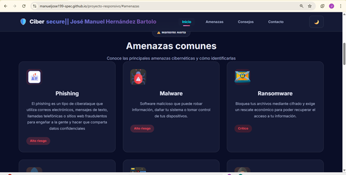
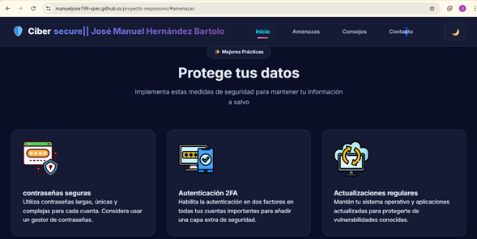
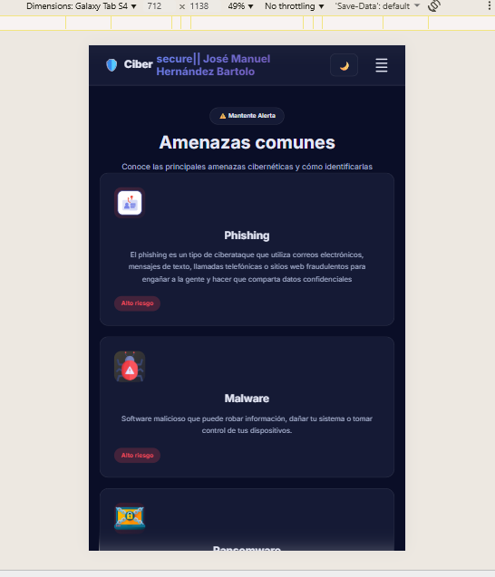

# EVIDENCIAS DEL PROYECTO

**Proyecto:** Landing Page de Ciberseguridad Digital
**Autor:** José Manuel Hernández Bartolo

## 📸 Capturas de Pantalla

### Vista Móvil (~375px)

### Vista Móvil (~412px)

### Vista Móvil (~430px)

### Vista Desktop (~1280px)

### Vista Tablet (~768px) 

### Vista Tablet (~1024px)

## ⚙️ Configuración de GitHub Pages

## 📚 Aprendizajes

### 1. ¿Qué fue lo más fácil y lo más retador del proyecto?

- Crear la estructura HTML semántica fue un poco facil gracias a la práctica previa con etiquetas como header, nav, main, seccion, footer, articule permiten una mejor organización semantica y form, label, input para el formularios.
  
- Aplicar estilos básicos de CSS como colores, tipografías.
  
- El despliegue en GitHub Pages fue sencillo siguiendo la configuración de Settings.

**Lo más retador:**

- **Hacer el diseño completamente responsivo** fue el mayor reto. Lograr que el contenido se viera bien en móvil, tablet y desktop requirió muchas pruebas y ajustes de media queries y apoyo de documentación y en ocaciones de IA.
  
- **El menú hamburguesa funcional** me costó trabajo porque tuve que combinar CSS y JavaScript para que se mostrara/ocultara correctamente.
  
- **Evitar el overflow horizontal en móvil** fue complicado. Tuve que ajustar padding, márgenes y tamaños de elementos varias veces hasta que dejó de acomodarse el contenido.

### 2. ¿Qué partes de HTML semántico y Flexbox usaste y por qué?

**HTML Semántico:**

Utilicé las siguientes etiquetas semánticas:

- `<header>` - Para el encabezado con logo y navegación

- `<nav>` - Para la barra de navegación con links

- `<main>` - Para envolver todo el contenido principal

- `<section>` - Para dividir las áreas: hero, amenazas, consejos, contacto
  
- `<article>` - Dentro de cada tarjeta de amenaza

- `<footer>` - Para el pie de página con información adicional

- `<form>`, `<label>`, `<input>` - Para el formulario de contacto con validaciones

**¿Por qué HTML semántico?**

Porque hace el código más legible y ordenado

**Flexbox:**

- **Navbar**: Para alinear horizontalmente el logo, menú y botón de tema con `justify-content: space-between`
- **Contenedor-hero**: Para crear el layout de dos columnas `display: grid` 
- **Botones**: Para alinear iconos y texto con `display: flex`
- **Cards**: El grid de tarjetas usa `display: grid` pero cada tarjeta
- **Footer**: Para distribuir las columnas de información
- **Estadísticas**: Para alinear horizontalmente los números con `display: flex` y `wrap`

**¿Por qué Flexbox?**

Es una buean herramienta para alinear elementos

### 3. ¿Cómo organizaste tus media queries y breakpoints?

**Enfoque:**diseñé primero para escritorio y luego adapté a móvil y tablet

**Breakpoints elegidos:**

**@media (max-width: 1200px)** - Tablet/Laptop pequeña

- El hero de 2 columnas
- El formulario  en una columna y los medios de contacto en otra
  
**@media (max-width: 768px)** - Tablet/Móvil grande

- Aparece el menú hamburguesa
- La navegación se convierte en menú vertical desplegable
- Ajustes de tamaño de fuente 
- Padding para evitar que el contenido toque los bordes
- Botones hero en columna vertical

**@media (max-width: 480px)** - Móvil pequeño

- Botones grandes
- Reducción de tamaños de fuente
- se acomodan logo e iconos más pequeños
  
### 4. ¿Qué mejorarías en una siguiente versión?

**Funcionalidad:**

- Hacer que el formulario de contacto realmente envíe datos
- Agregar otro tipo de animaciones
- Implementar un modal que descriva de mejor manera cada amenaza al hacer clic en las tarjetas
- Agregar un sistema de búsqueda o filtros para las amenazas
- Hacer que el banner de cookies guarde la preferencia del usuario en el almacenamiento del navegador

**Diseño:**

- Mejorar la experiencia de usuario con mejor contraste de colores en ambos modos
- Agregar más interaciones
- Mejorar el diseño del formulario y envio de datos
  

## 🎯 Reflexión Final

Este proyecto me permitió aplicar todo lo aprendido en el módulo de HTML y CSS. El mayor aprendizaje fue entender que el diseño responsivo no es solo agregar media queries, sino pensar desde el inicio en cómo se verá el contenido en diferentes dispositivos y ordenamiento del código.

## Aprendí a:

- Planificar mejor la estructura
- Usar Git de forma más consistente con commits descriptivos
- Probar constantemente en diferentes tamaños de pantalla
- Ser más paciente al depurar errores de layout
- Valorar la importancia del HTML semántico para mejor orden
  
**Herramientas utilizadas:**

- VS Code como editor
- Chrome DevTools para debugging responsivo
- Git Bash para control de versiones
- GitHub Pages para hosteo
- Google Fonts para tipografías

## 📌 Enlaces Importantes

**Repositorio:**https://github.com/manueljose199-spec/proyecto-responsivo
**GitHub Pages:**https://manueljose199-spec.github.io/proyecto-responsivo/

